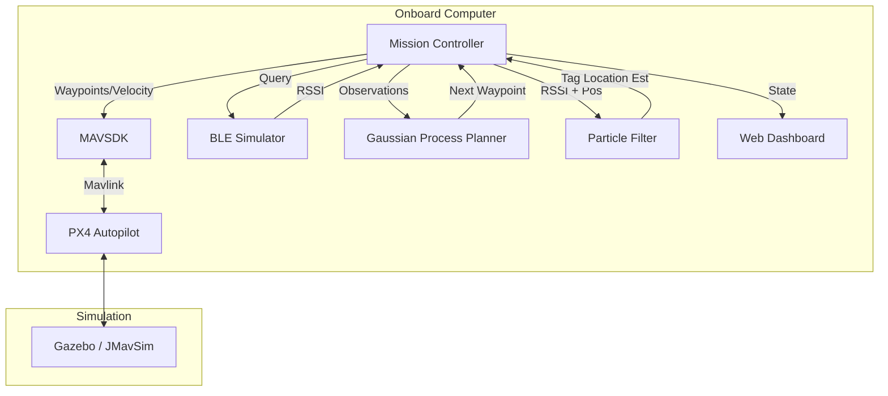
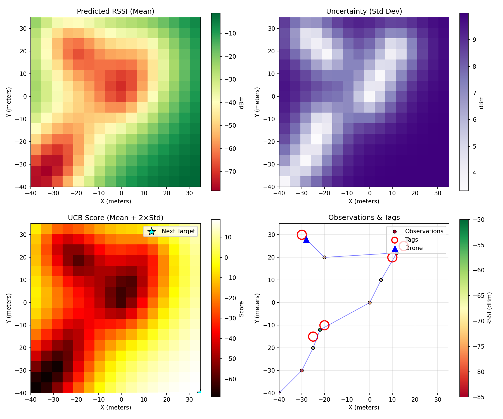
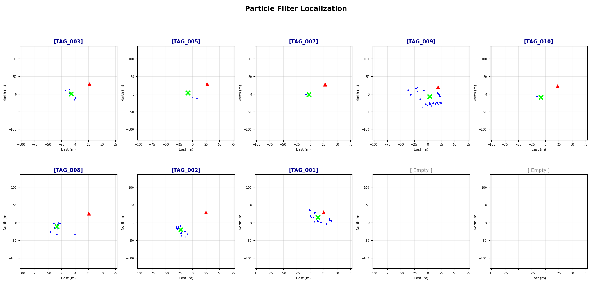

# PX4 BLE Scan Project

This repository implements an autonomous mission control system for scanning, detecting, and localizing Bluetooth Low Energy (BLE) tags using the PX4 flight stack and MAVSDK.

### 🎯 Project Utility
This system provides a foundation for:
*   **Search and Rescue (SAR)**: Locating beacons or missing persons carrying BLE devices.
*   **Asset Tracking**: Autonomous inventory scanning in large warehouses or outdoor yards.
*   **Algorithm Development**: A safe, simulation-first environment for testing complex path planning and localization logic.

## 📂 Repository Structure

This project uses a split-repository approach:

*   **`PX4-Autopilot/`** (Submodule): Points to the official [PX4-Autopilot](https://github.com/PX4/PX4-Autopilot) repository. It contains the firmware and simulation environment.
*   **`mavlink_scripts/`**: Contains the custom Python code for the autonomous mission.
    *   `core/`: Main mission logic (`intelligent_mission.py`).
    *   `localization/`: Particle filter and Gaussian Process mapping.
    *   `simulation/`: Bluetooth tag simulation and environment setup.
    *   `interface/`: Visualization and dashboard tools.
*   **`scan-dashboard/`**: Web-based dashboard for mission monitoring (WIP).

## 🚀 Getting Started

### 1. Clone the Repository
Since this repo uses submodules, clone it recursively:
```bash
git clone --recursive https://github.com/your-username/px4_mavsdk_ble_scan.git
cd px4_mavsdk_ble_scan
```
*If you already cloned it without `--recursive`, run:* `git submodule update --init --recursive`

### 2. Prerequisites
- **PX4 Toolchain**: Follow the [PX4 Dev Guide](https://docs.px4.io/main/en/dev_setup/building_px4.html) to install toolchains for your OS.
- **Python 3.8+**: Required for MAVSDK scripts.
- **MAVSDK**: Install the Python library:
  ```bash
  pip install mavsdk numpy matplotlib websockets pyyaml
  ```

### 3. Running the Simulation

#### Step A: Start PX4 SITL
Open a terminal and launch the PX4 simulation:
```bash
cd PX4-Autopilot
make px4_sitl gz_500
```


#### Step B: Spawn Tags
Open a new terminal and run the tag spawning script:
```bash
python3 mavlink_scripts/simulation/spawn_tag_markers.py
```

#### Step C: Run the Mission
Open a new terminal and run main mission script:
```bash
python3 mavlink_scripts/core/intelligent_mission.py
```

## 🧠 System Overview
The system implements an "Intelligent Mission" controller that:

*   **Predictive Exploration**: Uses a Gaussian Process (GP) to model signal uncertainty and guide the drone to areas with the highest probability of tag discovery.
*   **Precision Localization**: A Particle Filter integrates noisy RSSI (signal strength) data to converge on the exact coordinates of static BLE tags.
*   **Simulation-First Design**: Full integration with Gazebo (GZ) via the PX4 SITL stack.

### System Architecture



### Visual Demonstrations


*Gaussian Process Belief Map*


*Particle Filter Localization*

## 🛠 Git Management
- **PX4 Updates**: The `PX4-Autopilot` folder is a submodule. It points to a specific commit of the upstream repo. To update it:
  ```bash
  cd PX4-Autopilot
  git checkout main
  git pull
  cd ..
  git add PX4-Autopilot
  git commit -m "Update PX4 submodule"
  ```
